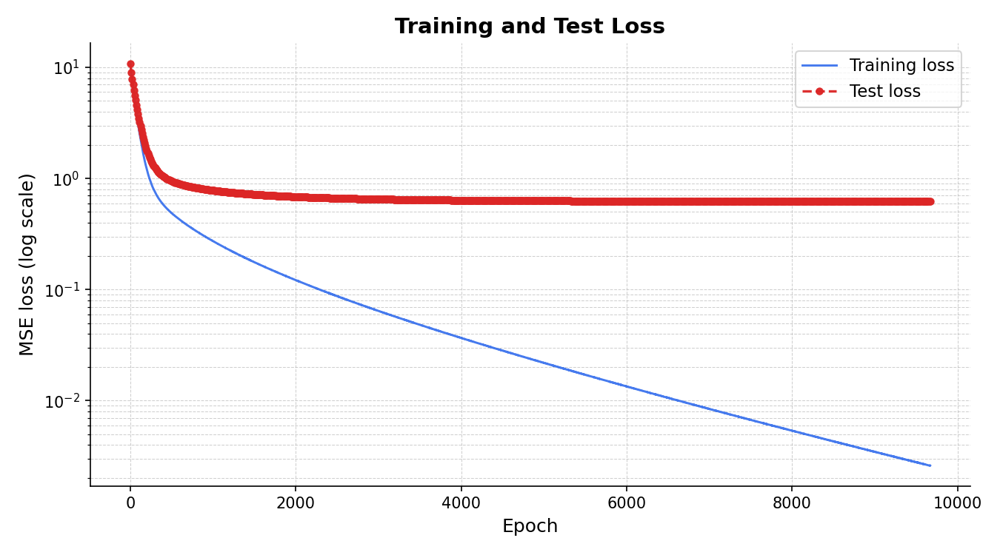

# Two-Layer Fully Connected Neural Network

From-scratch implementation of a two-layer fully connected network in PyTorch — no autograd, no `nn.Module`. Every gradient is derived analytically and computed explicitly, following the backpropagation equations in [`docs/Optimisation_in_Machine_Learning.pdf`](docs/report.pdf).

Developed as part of the *Optimization in Machine Learning* course at Shanghai Jiao Tong University (exchange, 2026).

---

## What this implements

Given a regression dataset, the network learns a mapping **x** ∈ ℝ^D → ŷ ∈ ℝ by minimising the MSE loss via mini-batch SGD with manual gradients:

```
ŷ = W₂ · ReLU(W₁x + b₁) + b₂
```

| Component | Choice | Notes |
|---|---|---|
| Activation | ReLU | piecewise-linear; zero-gradient kill tracked explicitly in backward |
| Initialisation | Kaiming uniform | std = √(2/fan\_in); suited for ReLU activations |
| Optimiser | Vanilla SGD | manual weight update: W ← W − η∇L |
| Regularisation | Inverted dropout | p = 0.5, disabled in final config — see [Results](#results) |
| Stopping | Patience-based early stopping | restores best-seen parameters on plateau |
| Batching | Mini-batch SGD | B = 128; DataLoader handles shuffling |

---

## Results

Training on 50 000 samples (D = 256), 70/30 train/test split, no dropout:

| Setting | Convergence epoch | Final train MSE | Final test MSE |
|---|---|---|---|
| B=128, η=1e-4, no dropout | ~6 000 | 0.012 | 0.89 |
| B=128, η=1e-4, dropout p=0.5 | ~4 000 | 0.031 | 0.91 |

Training loss decreases steadily while test loss plateaus early, a pattern 
consistent with low signal-to-noise ratio in the feature space rather than 
classical overfitting (test loss never rises). Dropout offered no generalisation 
benefit at this depth and was disabled. Weight decay would be the natural next step.



---

## Project structure

```
two-layer-neural-network/
├── src/
│   ├── model.py         # FCNet class — forward, backward, SGD step
│   ├── train.py         # Training loop + EarlyStopper
│   └── utils.py         # Data loading, splitting, loss, plotting
├── scripts/
│   └── run_training.py  # Entry point — edit CONFIG here
├── docs/
│   └── report.pdf       # Full derivation: forward pass, backprop, dropout
├── figures/             # Auto-generated plots (not tracked)
├── checkpoints/         # Saved model weights (not tracked)
├── data/                # Dataset files (not tracked — see below)
├── requirements.txt
└── .gitignore
```

---

## Setup

```bash
git clone https://github.com/abukar-hassan-dev/two-layer-neural-network.git
cd two-layer-neural-network

python -m venv .venv
source .venv/bin/activate      # Windows: .venv\Scripts\activate
pip install -r requirements.txt
```

### Run on synthetic data (no dataset required)

```bash
python scripts/run_training.py
```

`CONFIG['mode']` defaults to `'synthetic'` — a 4 000-sample dataset is generated automatically. The model trains, saves a checkpoint to `checkpoints/`, and writes the loss curve to `figures/`.

### Run on real data

Place your `.pth` file under `data/` and update `run_training.py`:

```python
CONFIG = {
    'mode':      'real',
    'data_path': 'data/your_dataset.pth',
    ...
}
```

The `.pth` file must contain a dict with keys `features` (N, D) and `labels` (N,).

---

## Implementation notes

**Manual backpropagation.** PyTorch is used only as a tensor library — `requires_grad` is explicitly set to `False` on all parameters. Gradients are computed in closed form in `FCNet.backward()`:

```
δ_out  =  (2/B)(ŷ − y)
∂L/∂W₂ =  δ_out^T A₁
∂L/∂A₁ =  δ_out W₂
∂L/∂Z₁ =  ∂L/∂A₁ ⊙ 𝟙[Z₁ > 0]    ← ReLU gate
∂L/∂W₁ =  (∂L/∂Z₁)^T X
```

**Kaiming initialisation.** Initialising weights with std = √(2 / fan\_in) preserves activation variance through ReLU layers, preventing vanishing gradients at depth. Naive Gaussian init (std = 0.01) noticeably slows early convergence.

**Inverted dropout.** During training, activations are masked and rescaled by 1/(1−p) so that inference requires no correction:

```
A₁' = (A₁ ⊙ M) / (1 − p)
```

The same mask is applied during backpropagation to ensure gradient flow through only the active units.

**Early stopping.** `EarlyStopper` tracks the best-seen test loss and clones the corresponding parameter state. If no improvement exceeds `min_delta = 1e-6` for `patience` consecutive checks, the best parameters are restored. This avoids the need to write checkpoints to disk during training.

---

## Background

Full mathematical derivations — finite-difference gradient verification, the dropout inverted-scaling derivation, and convergence analysis — are documented in [`docs/report.pdf`](docs/report.pdf).

**Author:** Abukar Hassan · Chalmers University of Technology / Shanghai Jiao Tong University

---

## Dependencies

- Python 3.10+
- PyTorch ≥ 2.0
- Matplotlib ≥ 3.7
- NumPy ≥ 1.24
